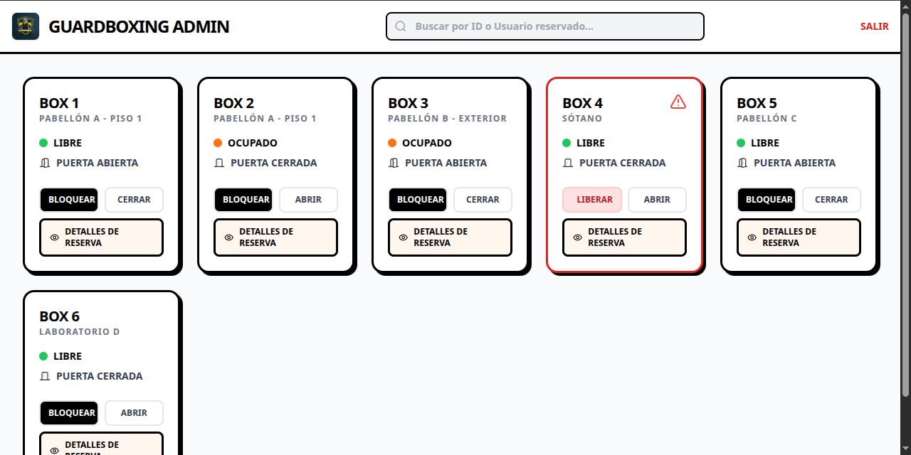
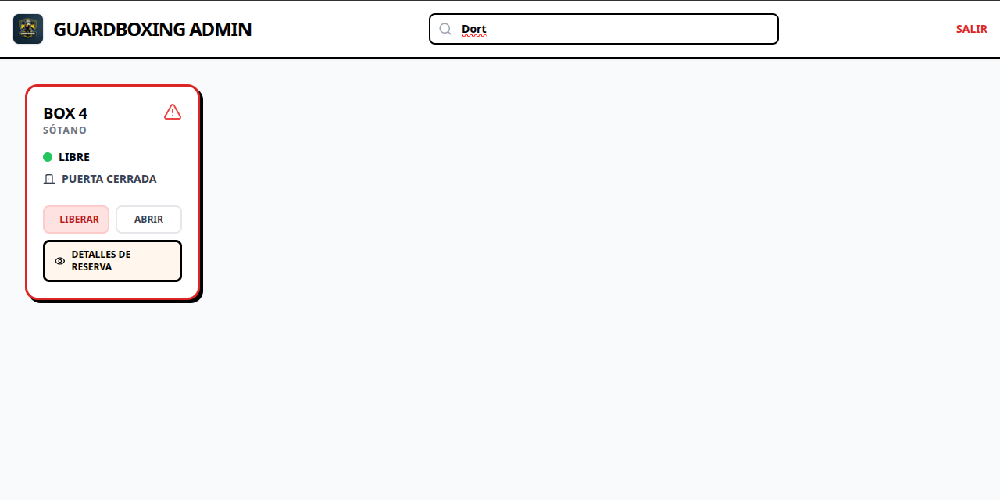

# GuardBoxing (Admin & Backend) 📦

Sistema de gestión para casilleros inteligentes (IoT Smart Lockers). Este repositorio contiene el panel de administración web, el backend y los conectores API que gobiernan y monitorizan el estado en tiempo real de toda la red de casilleros de la aplicación móvil [WasabiDefinitive / GuardBox](https://github.com/RedDeadth/WasabiDefinitive).

## 🚀 Arquitectura del Proyecto

El sistema está dividido internamente en dos capas (Monorrepo):

### 1. `shield/` (Backend - Django)
*   **Gestor y Base de Datos**: Orquesta el acceso a la lógica de negocio sólida en Python, proporcionando reglas de seguridad del lado del administrador usando el framework de Django.
*   **Conectividad**: Interactúa o sincroniza parámetros adicionales que complementan el motor principal no-relacional de Firebase.

### 2. `frontend/` (Web Admin Panel - React)
*   **Panel Administrativo**: Una Single Page Application (SPA) en React diseñada para observar los estatus de ocupación general, el control de accesos, e interpretar los historiales de forma visual en la nube en navegadores de escritorio.

---

## 📸 Pantallas Administrativas

| Acceso Híbrido (Google/Manual) | Panel Principal (Tiempo Real) |
| :---: | :---: |
|  |  |
| **Buscador Predictivo de Arrendatarios** | **Detalle Individual de Casilleros** |
|  |  |

---

## 🛠 Entorno Técnico

- **Backend:** Python + Django
- **Frontend Dashboard:** React.js, Node.js (`npm` / `vite`)
- **IoT & Live Database:** Firebase Realtime Database (Sincronizado con app Android hermana).
- **Control de Versiones:** Git con exclusiones rigurosas de entornos virtuales (`.gitignore`).

## 📦 Instrucciones de Instalación y Despliegue Local

### 1. Requisitos Previos
*   [Python 3.9+](https://www.python.org/downloads/)
*   [Node.js 18+](https://nodejs.org/)

### 2. Inicializar el Backend (Django)

```bash
# Clonar y entrar al repositorio principal
git clone https://github.com/RedDeadth/GuardBoxing.git
cd GuardBoxing

# Levantar entorno virtual limpio e instalar
python -m venv venv
# Activar (Windows)
.\venv\Scripts\activate 
# Activar (Mac/Linux)
source venv/bin/activate

# Instalar los recuadros
pip install -r requirements.txt # (o manualmente según directivas de modules)

# Realizar migración base de Django
python shield/manage.py migrate

# Correr el servidor web local
python shield/manage.py runserver
```

> **¡Advertencia de Seguridad!** Por favor renombra `.env.example` a `.env` y ubica o genera una nueva `SECRET_KEY` de Django válida.

### 3. Levantar el Panel Front-end (React)

En una **nueva terminal**, ingresa a la sub-carpeta dedicada:

```bash
cd GuardBoxing/frontend

# Descargar módulos node
npm install

# Correr el portal en desarrollo
npm start
```

---

## 📂 Organización de Carpetas Clave

```text
GuardBoxing/
├── shield/                  # 🛡️ Backend principal Django
│   ├── manage.py            # Orquestador del backend local
│   ├── core_app/            # Lógica y configuraciones (Rutas, Base de Datos, WSGI/ASGI)
│   └── ...                  # Apps adicionales del panel (Views, Models)
├── frontend/                # 💻 Panel de monitorización React
│   ├── src/                 # Componentes de usuario de los cajones
│   ├── public/              # Archivos estáticos de interfaz e iconografía
│   └── package.json         # Gestor Vite/CRA
├── .env.example             # Ejemplo de llaves protegidas
├── .gitignore               # Reglas de seguridad para prevenir upload de envs
└── README.md                # Presente documento
```
