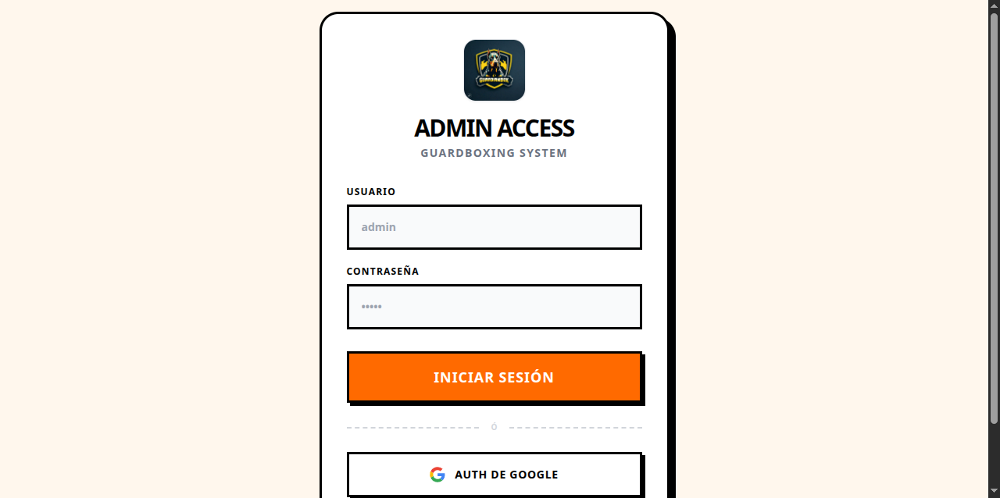
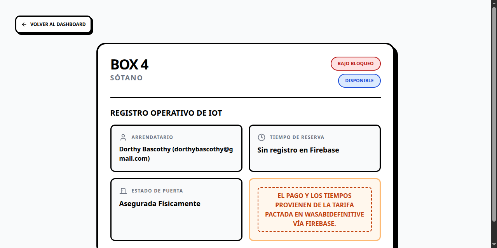

# GuardBoxing (Admin & Backend) 📦
[English](#english) | [Español](#español)

## English
Management system for smart lockers (IoT Smart Lockers). This repository contains the web administration panel, the backend, and the API connectors that govern and monitor in real-time the state of the entire locker network for the mobile application [WasabiDefinitive / GuardBox](https://github.com/RedDeadth/WasabiDefinitive).

### 🚀 Project Architecture
The system is internally divided into two layers (Monorepo):

#### 1. `shield/` (Backend - Django)
*   **Manager and Database**: Orchestrates access to solid business logic in Python, providing administrator-side security rules using the Django framework.
*   **Connectivity**: Interacts with or synchronizes additional parameters that complement the main non-relational Firebase engine.

#### 2. `frontend/` (Web Admin Panel - React)
*   **Administrative Panel**: A React Single Page Application (SPA) designed to observe general occupancy status, access control, and interpret histories visually in the cloud across desktop browsers.

---

### 📸 Administrative Screens

| Hybrid Access (Google/Manual) | Main Dashboard (Real Time) |
| :---: | :---: |
|  |  |
| **Predictive Tenant Search** | **Individual Locker Detail** |
|  |  |

---

### 🛠 Technical Environment
- **Backend:** Python + Django
- **Frontend Dashboard:** React.js, Node.js (`npm` / `vite`)
- **IoT & Live Database:** Firebase Realtime Database (Synchronized with sister Android app).
- **Version Control:** Git with rigorous exclusions for virtual environments (`.gitignore`).

### 📦 Installation and Local Deployment Instructions

#### 1. Prerequisites
*   [Python 3.9+](https://www.python.org/downloads/)
*   [Node.js 18+](https://nodejs.org/)

#### 2. Initialize Backend (Django)
```bash
# Clone and enter the main repository
git clone https://github.com/RedDeadth/GuardBoxing.git
cd GuardBoxing

# Set up a clean virtual environment and install
python -m venv venv
# Activate (Windows)
.\venv\Scripts\activate 
# Activate (Mac/Linux)
source venv/bin/activate

# Install requirements
pip install -r requirements.txt
# Run base Django migrations
python shield/manage.py migrate
# Run local web server
python shield/manage.py runserver
```

> **💡 Critical Credentials Configuration:** 
> 1. Rename `.env.example` to `.env` and inject a new valid Django `SECRET_KEY`.
> 2. Rename `firebase-adminsdk.json.example` by entering the exact name your `settings.py` expects (e.g. `guardianbox-2636d-firebase-adminsdk...json`) and replace its placeholder content with the real access keys downloaded from your Firebase Console Service Accounts.

#### 3. Start Front-end Panel (React)
In a **new terminal**, enter the dedicated sub-folder:
```bash
cd GuardBoxing/frontend
# Download node modules
npm install
# Run the portal in development
npm start
```

---

### 📂 Key Folder Organization
```text
GuardBoxing/
├── shield/                  # 🛡️ Main Django Backend
│   ├── manage.py            # Local backend orchestrator
│   ├── core_app/            # Logic and configurations (Routes, Database, WSGI/ASGI)
│   └── ...                  # Additional panel apps (Views, Models)
├── frontend/                # 💻 React monitoring panel
│   ├── src/                 # User components
│   ├── public/              # Static interface files and iconography
│   └── package.json         # Vite/CRA Manager
├── .env.example             # Protected keys example
├── .gitignore               # Security rules to prevent environmental variables upload
└── README.md                # Present document
```

---

## Español
Sistema de gestión para casilleros inteligentes (IoT Smart Lockers). Este repositorio contiene el panel de administración web, el backend y los conectores API que gobiernan y monitorizan el estado en tiempo real de toda la red de casilleros de la aplicación móvil [WasabiDefinitive / GuardBox](https://github.com/RedDeadth/WasabiDefinitive).

### 🚀 Arquitectura del Proyecto
El sistema está dividido internamente en dos capas (Monorrepo):

#### 1. `shield/` (Backend - Django)
*   **Gestor y Base de Datos**: Orquesta el acceso a la lógica de negocio sólida en Python, proporcionando reglas de seguridad del lado del administrador usando el framework de Django.
*   **Conectividad**: Interactúa o sincroniza parámetros adicionales que complementan el motor principal no-relacional de Firebase.

#### 2. `frontend/` (Web Admin Panel - React)
*   **Panel Administrativo**: Una Single Page Application (SPA) en React diseñada para observar los estatus de ocupación general, el control de accesos, e interpretar los historiales de forma visual en la nube en navegadores de escritorio.

---

### 📸 Pantallas Administrativas

| Acceso Híbrido (Google/Manual) | Panel Principal (Tiempo Real) |
| :---: | :---: |
|  |  |
| **Buscador Predictivo de Arrendatarios** | **Detalle Individual de Casilleros** |
|  |  |

---

### 🛠 Entorno Técnico

- **Backend:** Python + Django
- **Frontend Dashboard:** React.js, Node.js (`npm` / `vite`)
- **IoT & Live Database:** Firebase Realtime Database (Sincronizado con app Android hermana).
- **Control de Versiones:** Git con exclusiones rigurosas de entornos virtuales (`.gitignore`).

### 📦 Instrucciones de Instalación y Despliegue Local

#### 1. Requisitos Previos
*   [Python 3.9+](https://www.python.org/downloads/)
*   [Node.js 18+](https://nodejs.org/)

#### 2. Inicializar el Backend (Django)
```bash
# Clonar y entrar al repositorio principal
git clone https://github.com/RedDeadth/GuardBoxing.git
cd GuardBoxing

# Levantar entorno virtual limpio e instalar
python -m venv venv
# Activar (Windows)
.\venv\Scripts\activate 
# Activar (Mac/Linux)
source venv/bin/activate

# Instalar los requerimientos
pip install -r requirements.txt
# Realizar migración base de Django
python shield/manage.py migrate
# Correr el servidor web local
python shield/manage.py runserver
```

> **💡 Configuración de Credenciales Críticas:** 
> 1. Renombra `.env.example` a `.env` e inyecta una nueva `SECRET_KEY` de Django válida.
> 2. Renombra `firebase-adminsdk.json.example` introduciendo el nombre exacto que persigue tu `settings.py` (Ej. `guardianbox-2636d-firebase-adminsdk...json`) y reemplaza su interior falso por las llaves reales de acceso descargadas desde las Cuentas de Servicio de tu Consola Firebase.

#### 3. Levantar el Panel Front-end (React)
En una **nueva terminal**, ingresa a la sub-carpeta dedicada:
```bash
cd GuardBoxing/frontend
# Descargar módulos node
npm install
# Correr el portal en desarrollo
npm start
```

---

### 📂 Organización de Carpetas Clave
```text
GuardBoxing/
├── shield/                  # 🛡️ Backend principal Django
│   ├── manage.py            # Orquestador del backend local
│   ├── core_app/            # Lógica y configuraciones (Rutas, Base de Datos, WSGI/ASGI)
│   └── ...                  # Apps adicionales del panel (Views, Models)
├── frontend/                # 💻 Panel de monitorización React
│   ├── src/                 # Componentes de usuario de los cajones
│   ├── public/              # Archivos estáticos de interfaz e iconografía
│   └── package.json         # Gestor Vite/CRA
├── .env.example             # Ejemplo de llaves protegidas
├── .gitignore               # Reglas de seguridad para prevenir upload de envs
└── README.md                # Presente documento
```
